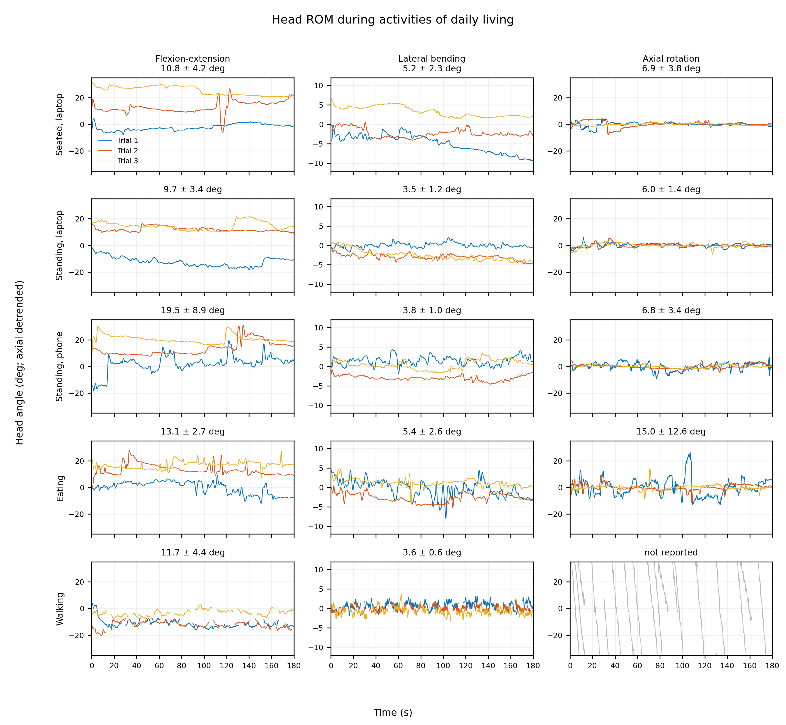

# Head orientation during activities of daily living

A single-participant feasibility study using a forehead-mounted smartphone IMU to quantify head-orientation excursion during five activities: seated laptop work, standing laptop work, standing phone use, eating, and level walking.


## Project contents

- Three trials per activity plus one calibration recording
- Fixed 180 s analysis windows at 50 Hz
- Flexion-extension, lateral-bending, and axial-rotation excursion estimates
- Trial-to-trial flexion-extension coefficient of variation (CV)
- Straight-walking analysis with lap turns excluded
- Reproducible MATLAB code, raw inputs, results tables, and plots

## Run in MATLAB

Requires MATLAB R2019b or later and Signal Processing Toolbox.

```matlab
head_rom_analysis
```

The script extracts `data/raw_data.zip` automatically on the first run and generates:

- `TableI_results.csv` — task-level head-orientation excursion results
- `TableII_checks.csv` — sampling, noise, drift, and mount checks
- `TableIII_gravity_sensitivity.csv` — results at 0.3, 0.5, and 1.0 Hz gravity cutoffs
- `TableIV_turn_sensitivity.csv` — walking results at 20, 25, and 30 deg/s turn thresholds
- `Fig1_traces.png` — all processed 180 s movement traces
- `Fig2_flexext_statistics.png` — combined mean, SD, variance, and CV plot for flexion-extension excursion

## Results preview




## Processing summary

Gyroscope and acceleration data are resampled to 50 Hz. Accelerometer data are low-pass filtered at 0.5 Hz to estimate the slowly varying gravity direction used for sagittal and lateral inclination. Gyroscope-derived yaw rate is low-pass filtered at 5 Hz. Each trial is referenced to its own neutral hold. Excursion is calculated from the 2.5th-97.5th percentile span. For each task, flexion-extension CV is calculated across the three trial-level excursion values as 100 × SD/mean and is treated as a descriptive repeatability measure. During walking, lap turns are removed at an absolute yaw rate above 25 deg/s and axial rotation is not reported. Sensitivity checks repeat the analysis across 0.3-1.0 Hz gravity cutoffs and 20-30 deg/s turn thresholds.

## Limits

This is a one-participant method demonstration using a consumer smartphone sensor. It was not validated against optical motion capture and does not provide clinical or population reference values. A single head sensor measures orientation in space and cannot separate cervical motion from trunk motion. The sagittal and lateral channels represent low-frequency inclination; axial rotation is the least reliable channel because it depends on integrated gyroscope data.

## References

- D. Demaree, J. Brignone, M. Bromberg, and H. Zhang, [“Preliminary Study on Effects of Neck Exoskeleton Structural Design in Patients With Amyotrophic Lateral Sclerosis,”](https://doi.org/10.1109/TNSRE.2024.3397584) *IEEE Transactions on Neural Systems and Rehabilitation Engineering*, 2024.
- A. R. Weston et al., [“Head and Trunk Kinematics during Activities of Daily Living with and without Mechanical Restriction of Cervical Motion,”](https://doi.org/10.3390/s22083071) *Sensors*, 2022. This related ADL study used wearable head and trunk sensors with a 6 Hz low-pass Butterworth filter.
- V. T. van Hees et al., [“Separating Movement and Gravity Components in an Acceleration Signal and Implications for the Assessment of Human Daily Physical Activity,”](https://doi.org/10.1371/journal.pone.0061691) *PLOS ONE*, 2013. This study evaluated 0.2 and 0.5 Hz cutoffs for accelerometer gravity separation.
- T. Fawden et al., [“Detection of Gait Events Using Ear-Worn IMUs During Functional Movement Tasks,”](https://doi.org/10.3390/s25113629) *Sensors*, 2025. Turning was identified using yaw angle and a 30 deg/s angular-velocity condition.
- [Sensor Logger documentation](https://www.tszheichoi.com/sensorloggerhelp), including its [coordinate-system](https://github.com/tszheichoi/awesome-sensor-logger/blob/main/COORDINATES.md) and [units](https://github.com/tszheichoi/awesome-sensor-logger/blob/main/UNITS.md) references.
