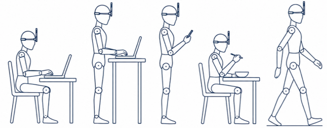
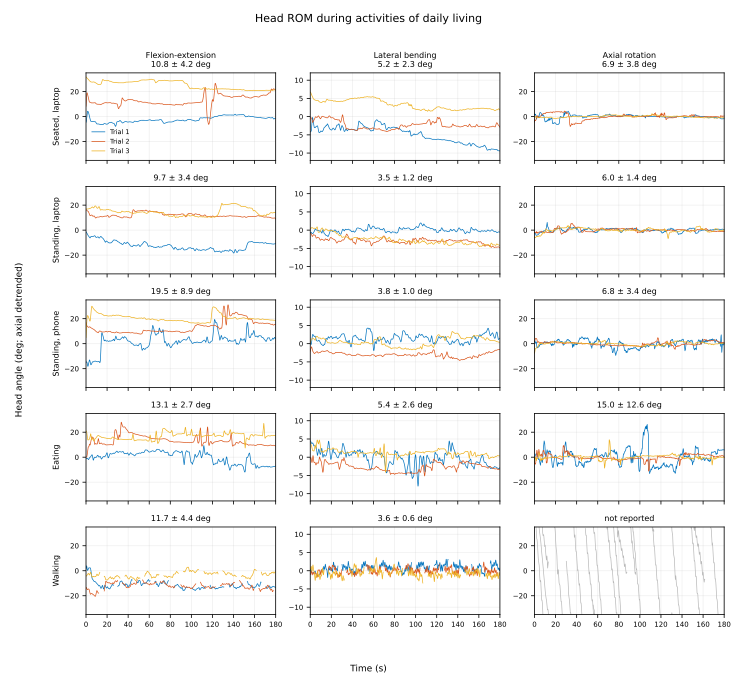
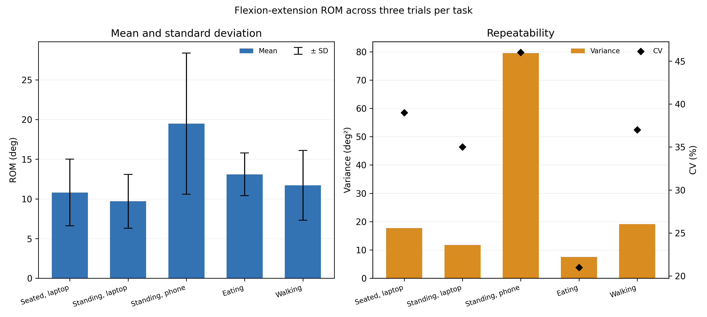

# Head orientation during activities of daily living

A single-participant feasibility study using a forehead-mounted smartphone IMU to quantify head-orientation excursion during five activities: seated laptop work, standing laptop work, standing phone use, eating, and level walking.



## Project contents

- Three trials per activity plus one calibration recording
- Fixed 180 s analysis windows at 50 Hz
- Flexion-extension, lateral-bending, and axial-rotation excursion estimates
- Trial-to-trial flexion-extension coefficient of variation (CV)
- Straight-walking analysis with lap turns excluded
- Reproducible MATLAB code, raw inputs, results tables, and plots

## Run in MATLAB

Requires MATLAB R2019b or later and Signal Processing Toolbox.

```matlab
head_rom_analysis
```

The script extracts `data/raw_data.zip` automatically on the first run and generates:

- `TableI_results.csv` — task-level head-orientation excursion results
- `TableII_checks.csv` — identified task/trial, sampling rate, quiet-hold variability, yaw trend, and initial phone inclination
- `TableIII_gravity_sensitivity.csv` — results at 0.3, 0.5, and 1.0 Hz gravity cutoffs
- `TableIV_turn_sensitivity.csv` — walking results at 20, 25, and 30 deg/s turn thresholds
- `Fig1_traces.png` and `Fig1_traces_updated.svg` — all processed 180 s movement traces
- `Fig2_flexext_statistics.png` — combined mean, SD, variance, and CV plot for flexion-extension excursion

## Results preview





Mean flexion-extension excursion ranged from 10.3 to 19.5 deg across tasks. Trial-to-trial CV ranged from 20% to 47%, so these values describe this feasibility recording and are not reference values. The measured sampling rate was 49.91-49.92 Hz, and quiet-hold SD was 0.06-0.44 deg. The walking analysis retained 77% of the fixed window after turn exclusion. Changing the gravity cutoff from 0.5 Hz to 0.3 or 1.0 Hz shifted any task mean by less than 0.7 deg; changing the turn threshold from 20 to 30 deg/s kept the walking mean between 14.3 and 14.6 deg.

## Processing summary

Gyroscope and acceleration data are resampled to a uniform 50 Hz clock. The quietest 2 s interval between 6 and 22 s is used as the trial reference, and the fixed 180 s analysis window starts 2 s after that reference. Accelerometer data are processed with a zero-phase, second-order 0.5 Hz Butterworth low-pass filter to estimate the slowly varying gravity direction used for sagittal and lateral inclination. Gyroscope-derived yaw rate is processed with a zero-phase, second-order 5 Hz Butterworth low-pass filter. No peaks are removed manually; excursion is calculated from the 2.5th-97.5th percentile span to reduce the influence of isolated extremes. The trace figure is median-centred only for visual comparison, which does not change excursion.

For each task, flexion-extension CV is calculated across the three trial-level excursion values as 100 × sample SD/mean and is treated as a descriptive repeatability measure. During walking, samples within the 2 s moving exclusion window around absolute yaw rates above 25 deg/s are removed, and axial rotation is not reported. The fitted yaw trend in `TableII_checks.csv` is a processing diagnostic rather than a pure sensor-drift measurement because it can contain real task motion. Sensitivity checks repeat the analysis across 0.3-1.0 Hz gravity cutoffs and 20-30 deg/s turn thresholds.

## Limits

This is a one-participant method demonstration using a consumer smartphone sensor and three trials per task. It was not validated against optical motion capture and does not provide clinical or population reference values. The tasks were not paced by a fixed movement script, which likely contributed to the 20-47% CV. A single head sensor measures orientation in space and cannot separate cervical motion from trunk motion, especially during walking. The sagittal and lateral channels represent low-frequency inclination; axial rotation is the least reliable channel because it depends on integrated gyroscope data.

## References

- D. Demaree, J. Brignone, M. Bromberg, and H. Zhang, [“Preliminary Study on Effects of Neck Exoskeleton Structural Design in Patients With Amyotrophic Lateral Sclerosis,”](https://doi.org/10.1109/TNSRE.2024.3397584) *IEEE Transactions on Neural Systems and Rehabilitation Engineering*, 2024.
- A. R. Weston et al., [“Head and Trunk Kinematics during Activities of Daily Living with and without Mechanical Restriction of Cervical Motion,”](https://doi.org/10.3390/s22083071) *Sensors*, 2022. This related ADL study used wearable head and trunk sensors with a 6 Hz low-pass Butterworth filter.
- V. T. van Hees et al., [“Separating Movement and Gravity Components in an Acceleration Signal and Implications for the Assessment of Human Daily Physical Activity,”](https://doi.org/10.1371/journal.pone.0061691) *PLOS ONE*, 2013. This study evaluated 0.2 and 0.5 Hz cutoffs for accelerometer gravity separation.
- T. Fawden et al., [“Detection of Gait Events Using Ear-Worn IMUs During Functional Movement Tasks,”](https://doi.org/10.3390/s25113629) *Sensors*, 2025. Turning was identified using yaw angle and a 30 deg/s angular-velocity condition.
- [Sensor Logger documentation](https://www.tszheichoi.com/sensorloggerhelp), including its [coordinate-system](https://github.com/tszheichoi/awesome-sensor-logger/blob/main/COORDINATES.md) and [units](https://github.com/tszheichoi/awesome-sensor-logger/blob/main/UNITS.md) references.
