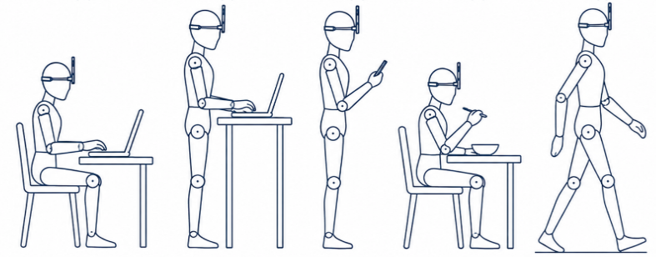
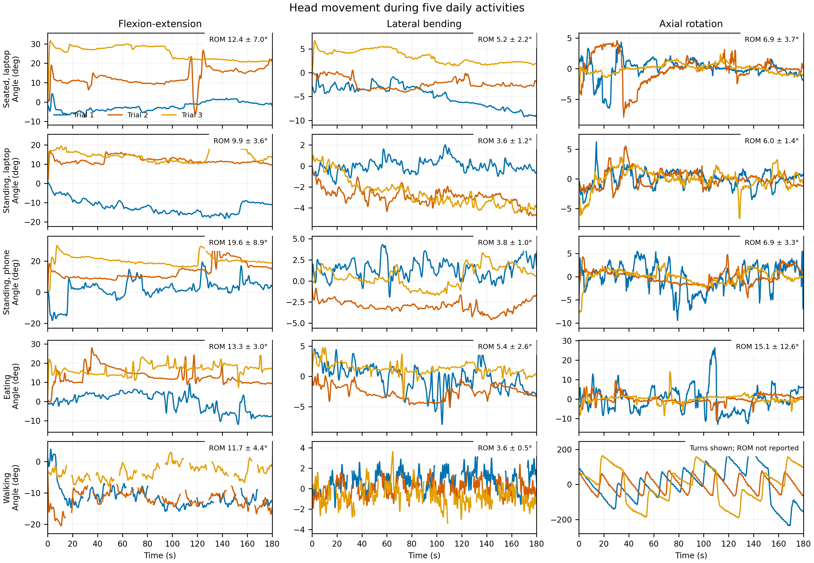
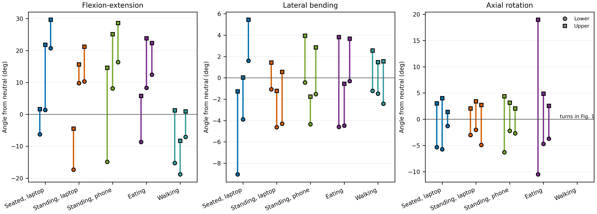

# Head ROM during activities of daily living

A single-participant feasibility study using a forehead-mounted smartphone IMU to measure head ROM during seated laptop work, standing laptop work, standing phone use, eating, and level walking.

For the previously published report, see the [feasibility report (PDF)](Head_Movement_ADL_Feasibility_Report.pdf). The code and preview figures now begin the 180 s window immediately after the neutral hold; the PDF has not yet been revised.







## Run

Requires MATLAB R2019b or later and Signal Processing Toolbox.

```matlab
head_rom_analysis
```

The main analysis uses one fixed parameter set:

| Setting | Selected value |
|---|---:|
| Resampling rate | 50 Hz |
| Gravity cutoff | 0.5 Hz |
| Yaw-rate cutoff | 5 Hz |
| Neutral hold | Quietest complete 10 s block in the first 30 s |
| Task window | 180 s, beginning immediately after the neutral hold |
| Walking-turn threshold | 25 deg/s* |

*Turn-threshold effect: 20 deg/s produced 11.94 deg mean walking flexion-extension ROM with 69.63% retained; 25 deg/s produced 11.70 deg with 76.97% retained; and 30 deg/s produced 11.70 deg with 77.79% retained. The ROM result is stable across these thresholds, while the retained amount changes.

## Processing

`readHeadTrial.m` reads one recording, measures its timestamp rate, interpolates gyroscope and acceleration channels onto the same uniform 50 Hz clock, identifies the neutral hold, defines the head reference frame, and returns three angle channels. The 0.5 Hz gravity estimate provides flexion-extension and lateral bending. Filtered gyroscope yaw rate is integrated for axial rotation.

Head ROM is calculated as:

```text
97.5th percentile - 2.5th percentile
```

This limits the effect of isolated peaks without manually deleting data. Mean, sample SD, variance, and CV are calculated across the three trial-level flexion-extension ROM values. Flexion-extension and lateral traces use the neutral reference; axial traces have a fitted linear trend removed. No trace is median-centred.

Walking consists of straight paths separated by approximately 180 deg direction changes. Samples within approximately 1 s of a yaw rate exceeding 25 deg/s are excluded from the straight-walking calculations to reduce abrupt changes at lap turns. The complete detrended walking axial-angle trace, including turns, appears in Figure 1. Walking axial ROM is not reported because a single head sensor cannot separate head motion from whole-body rotation during lap turns.

## Outputs

- `TableI_results.csv` — mean and SD for all three head ROM planes, flexion-extension variance and CV, and retained data
- `TableII_checks.csv` — per-trial sampling rate, neutral-hold SD, yaw trend, and neutral phone inclination
- `Fig1_traces.png` and `Fig1_traces_updated.svg` — 180 s head-angle traces, including walking axial rotation with its lap turns
- `Fig2_flexext_statistics.png` — one box per task in each plane, with solid task colors and black outlines. The centre line is the median; boxes span the quartiles and whiskers span the minimum and maximum. Each trial ROM is its 97.5th minus 2.5th percentile angle. Boxes summarize just three values, so interpret them descriptively. Walking axial angles appear in Figure 1, but walking axial ROM is excluded from Figure 2 because lap turns include whole-body rotation. Mean, SD, variance, and CV remain in `TableI_results.csv`.

## Separate validation

Parameter sensitivity is kept outside the main analysis:

```matlab
run('validation/validate_gravity_cutoff.m')
run('validation/validate_turn_threshold.m')
```

The gravity validation compares 0.3, 0.5, and 1.0 Hz. The turn validation compares 20, 25, and 30 deg/s. These values are not additional settings in the main analysis; they test whether nearby choices materially change the result.

## Limits

This is a one-participant method demonstration using a consumer smartphone and three trials per task. It was not validated against optical motion capture and does not provide clinical or population reference values. Unscripted movement and mount refitting may contribute to trial variability; their effects were not measured separately. A single head sensor measures head orientation in space and cannot separate head motion from trunk motion. The 0.5 Hz gravity filter attenuates faster movements, and yaw detrending can remove genuine slow rotation.

The committed tables and previews were regenerated with an independent Python reproduction. The revised MATLAB scripts have not yet been runtime-tested in MATLAB. The separate validation files are parameter-sensitivity checks, not validation against a reference instrument.

## References

- D. Demaree, J. Brignone, M. Bromberg, and H. Zhang, [“Preliminary Study on Effects of Neck Exoskeleton Structural Design in Patients With Amyotrophic Lateral Sclerosis,”](https://doi.org/10.1109/TNSRE.2024.3397584) *IEEE Transactions on Neural Systems and Rehabilitation Engineering*, 2024.
- A. R. Weston et al., [“Head and Trunk Kinematics during Activities of Daily Living with and without Mechanical Restriction of Cervical Motion,”](https://doi.org/10.3390/s22083071) *Sensors*, 2022. The study used wearable head and trunk sensors with a 6 Hz low-pass Butterworth filter.
- V. T. van Hees et al., [“Separating Movement and Gravity Components in an Acceleration Signal and Implications for the Assessment of Human Daily Physical Activity,”](https://doi.org/10.1371/journal.pone.0061691) *PLOS ONE*, 2013. The study evaluated 0.2 and 0.5 Hz cutoffs for gravity separation.
- [Android sensor coordinate system and sampling guidance](https://developer.android.com/develop/sensors-and-location/sensors/sensors_overview#sensors-coords).
